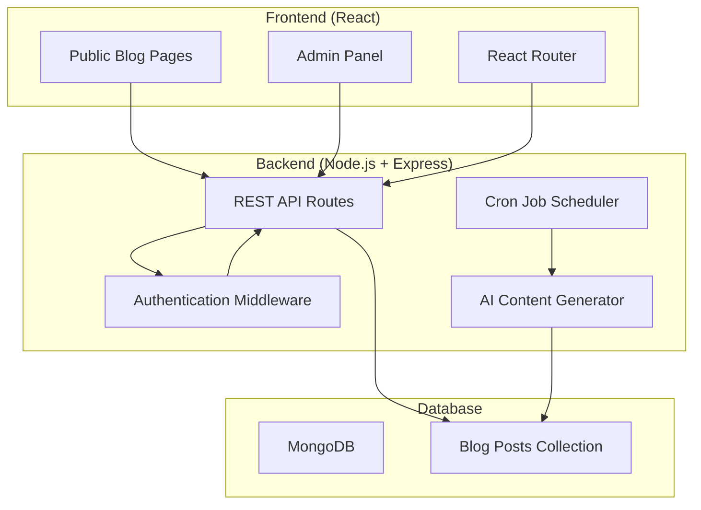
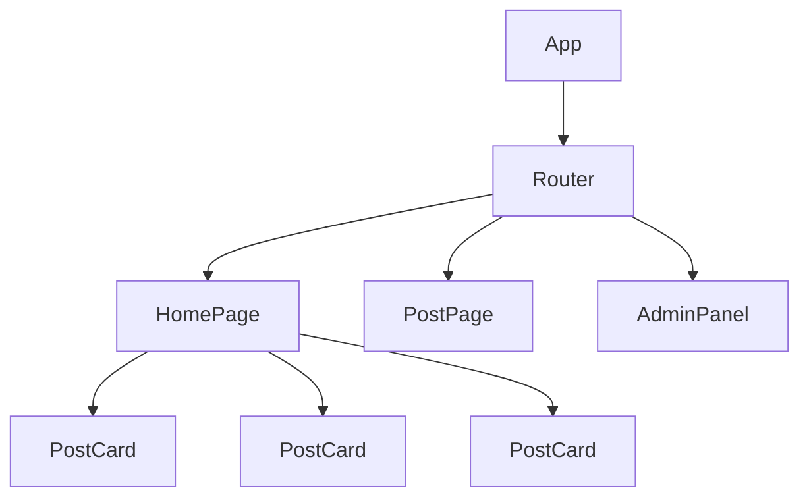

# Design Document

## Overview

The AI Blog Website is built using the MERN stack (MongoDB, Express.js, React, Node.js) to create a full-stack web application that combines automated AI content generation with manual admin posting capabilities. The system follows a client-server architecture where the React frontend communicates with an Express.js REST API backend, which manages data persistence in MongoDB and handles automated content generation through scheduled cron jobs.

## Architecture

### High-Level Architecture



### Technology Stack

- **Frontend**: React 18+ with React Router for navigation
- **Backend**: Node.js with Express.js framework
- **Database**: MongoDB with Mongoose ODM
- **Authentication**: Basic Authentication using express-basic-auth
- **Scheduling**: node-cron for automated AI post generation
- **AI Integration**: Configurable AI service (Gemini, OpenAI, or mock service)
- **Styling**: CSS3 with responsive design principles

## Components and Interfaces

### Frontend Components

#### Core React Components

1. **App Component**
   - Main application wrapper
   - Handles routing configuration
   - Manages global state if needed

2. **HomePage Component**
   - Displays paginated list of all blog posts
   - Shows post previews with metadata
   - Implements responsive grid layout

3. **PostPage Component**
   - Displays individual blog post content
   - Handles dynamic routing for post IDs
   - Shows full post content and metadata

4. **AdminPanel Component**
   - Protected admin interface
   - Contains post creation form
   - Handles form validation and submission

5. **PostCard Component**
   - Reusable component for post previews
   - Shows title, excerpt, date, and type indicator
   - Handles click navigation to full post

#### Component Hierarchy



### Backend API Structure

#### REST API Endpoints

1. **GET /api/posts**
   - Returns all blog posts sorted by date
   - Supports pagination parameters
   - Returns JSON array of post objects

2. **GET /api/posts/:id**
   - Returns specific blog post by ID
   - Handles 404 for non-existent posts
   - Returns single post object

3. **POST /api/admin/posts**
   - Creates new manual blog post
   - Requires authentication
   - Validates input data

4. **GET /api/admin/posts**
   - Returns posts for admin management
   - Requires authentication
   - Includes additional metadata

#### Middleware Stack

1. **CORS Middleware**
   - Enables cross-origin requests from React frontend
   - Configures allowed origins and methods

2. **Body Parser Middleware**
   - Parses JSON request bodies
   - Handles URL-encoded data

3. **Authentication Middleware**
   - Protects admin routes
   - Implements basic authentication
   - Returns 401 for unauthorized access

4. **Error Handling Middleware**
   - Catches and formats errors
   - Returns consistent error responses
   - Logs errors for debugging

## Data Models

### MongoDB Schema Design

#### BlogPost Schema

```javascript
{
  _id: ObjectId,
  title: {
    type: String,
    required: true,
    maxLength: 200
  },
  content: {
    type: String,
    required: true,
    maxLength: 10000
  },
  excerpt: {
    type: String,
    maxLength: 200
  },
  date: {
    type: Date,
    default: Date.now,
    index: true
  },
  ai_generated: {
    type: Boolean,
    default: false,
    index: true
  },
  slug: {
    type: String,
    unique: true,
    index: true
  },
  status: {
    type: String,
    enum: ['draft', 'published'],
    default: 'published'
  }
}
```

#### Data Validation Rules

- Title: Required, 1-200 characters
- Content: Required, 1-10000 characters
- Excerpt: Auto-generated from first 150 characters if not provided
- Slug: Auto-generated from title for SEO-friendly URLs
- Date: Automatically set on creation
- AI_generated: Boolean flag for content type identification

### Database Indexing Strategy

- Primary index on `_id` (default)
- Compound index on `date` (descending) for chronological sorting
- Index on `ai_generated` for filtering by content type
- Unique index on `slug` for URL routing
- Index on `status` for future draft/published functionality

## Error Handling

### Frontend Error Handling

1. **API Request Errors**
   - Network connectivity issues
   - Server response errors (4xx, 5xx)
   - Timeout handling

2. **Component Error Boundaries**
   - Catch React component errors
   - Display fallback UI
   - Log errors for debugging

3. **Form Validation Errors**
   - Client-side validation
   - Server-side validation feedback
   - User-friendly error messages

### Backend Error Handling

1. **Database Connection Errors**
   - MongoDB connection failures
   - Query execution errors
   - Connection timeout handling

2. **Authentication Errors**
   - Invalid credentials
   - Missing authentication headers
   - Session expiration

3. **Validation Errors**
   - Input data validation
   - Schema validation errors
   - File upload errors

4. **AI Service Errors**
   - API rate limiting
   - Service unavailability
   - Content generation failures

### Error Response Format

```javascript
{
  success: false,
  error: {
    code: "ERROR_CODE",
    message: "Human-readable error message",
    details: "Additional error details for debugging"
  }
}
```

## Testing Strategy

### Frontend Testing

1. **Unit Testing**
   - Component rendering tests
   - Props and state management
   - Event handler testing
   - Use Jest and React Testing Library

2. **Integration Testing**
   - API integration tests
   - Router navigation tests
   - Form submission workflows

3. **End-to-End Testing**
   - User journey testing
   - Cross-browser compatibility
   - Responsive design validation

### Backend Testing

1. **Unit Testing**
   - Route handler testing
   - Middleware functionality
   - Database model validation
   - Use Jest and Supertest

2. **Integration Testing**
   - API endpoint testing
   - Database integration
   - Authentication workflows

3. **Automated Testing**
   - Cron job execution testing
   - AI content generation testing
   - Error handling scenarios

### Testing Environment Setup

- **Test Database**: Separate MongoDB instance for testing
- **Mock Services**: Mock AI service for consistent testing
- **Test Data**: Seed data for consistent test scenarios
- **CI/CD Integration**: Automated testing on code changes

## Security Considerations

### Authentication Security

- Basic authentication for admin routes
- Secure credential storage
- Session management
- HTTPS enforcement in production

### Input Validation

- Server-side validation for all inputs
- XSS prevention through input sanitization
- SQL injection prevention (NoSQL injection for MongoDB)
- File upload restrictions

### API Security

- Rate limiting for API endpoints
- CORS configuration
- Request size limits
- Error message sanitization

### Database Security

- MongoDB connection string security
- Database user permissions
- Data encryption at rest
- Regular security updates

## Performance Optimization

### Frontend Performance

- Code splitting for React components
- Lazy loading for post content
- Image optimization
- Caching strategies for API responses

### Backend Performance

- Database query optimization
- Connection pooling
- Response compression
- Caching for frequently accessed data

### Database Performance

- Proper indexing strategy
- Query optimization
- Connection management
- Data archiving for old posts

## Deployment Architecture

### Development Environment

- Local MongoDB instance
- Node.js development server
- React development server with hot reload
- Environment variables for configuration

### Production Environment

- MongoDB Atlas or self-hosted MongoDB
- Node.js production server (PM2 or similar)
- React build served by Express static middleware
- Environment-specific configuration
- SSL/TLS certificates
- Load balancing considerations

### Environment Configuration

```javascript
// Environment variables
{
  NODE_ENV: 'production',
  MONGODB_URI: 'mongodb://...',
  PORT: 3000,
  ADMIN_USERNAME: 'admin',
  ADMIN_PASSWORD: 'secure_password',
  AI_SERVICE_API_KEY: 'api_key',
  CORS_ORIGIN: 'https://yourdomain.com'
}
```